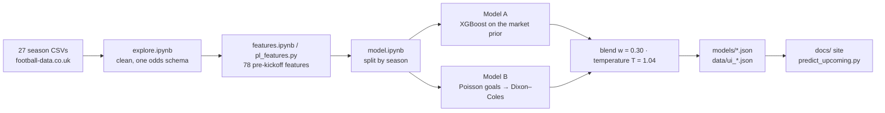

[](https://github.com/Daytoo77/pl-outcome-predictor/actions/workflows/pages.yml)
[](requirements.txt)
[](LICENSE)

**Live site:** https://daytoo77.github.io/pl-outcome-predictor/

A three-way classifier (home win / draw / away win) for Premier League fixtures,
trained on 25 seasons of results and priced against the bookmaker's own line.

Every feature is knowable before kickoff. The model starts from the vig-free
market probability as a prior and only tries to improve on it. On held-out
seasons it matches the market on log loss rather than beating it, which, out of
sample against a settled market, is the honest result. Draws are the hard class:
no pre-kickoff feature correlates with a draw, so the model treats a
well-calibrated P(draw) as the deliverable rather than the hard label, and under
argmax it never calls one.

## Results

Numbers on seasons the model never trained on. Log loss is the score that
matters (lower is better; a flat one-third guess scores 1.099).

| Slice | Matches | Model log loss | Market log loss | Accuracy | Always home |
|---|--:|--:|--:|--:|--:|
| Test, 2023-24 and 2024-25 | 699 | **0.946** | 0.949 | 56.1% | 43.9% |
| Holdout, 2025-26 (scored once) | 350 | 1.019 | **1.016** | 48.3% | 42.0% |

Rolling-origin check (refit before each season, score it alone): model log loss
stayed in 0.895–1.000 and beat the vig-free market in 5 of 7 seasons, mean edge
+0.002. Every figure on the site carries a pointer to the artefact it comes from,
and `tools/check_numbers.py` verifies all of them on every deploy.

## The pipeline



- **Model A**: XGBoost `multi:softprob`, depth 3, eta 0.03, `base_margin` = log of
  the vig-free market price, so the trees only model the residual.
- **Model B**: two `count:poisson` regressors for expected home and away goals,
  turned into a Dixon–Coles scoreline matrix (ρ = −0.11); H/D/A are the sums of
  its triangles.
- **Blend**: 0.30 · A + 0.70 · B, the weight that minimised log loss on the
  tuning block. **Calibration**: one temperature, T = 1.04.
- The stack is numpy + pandas + xgboost + pyarrow. Metrics, calibration and the
  Dixon–Coles matrix are hand-rolled in numpy; nothing depends on scikit-learn
  or scipy.

## Quickstart

```bash
git clone https://github.com/Daytoo77/pl-outcome-predictor.git
cd pl-outcome-predictor
python -m venv .venv
.venv\Scripts\activate          # Windows (cmd / PowerShell)
source .venv/bin/activate       # macOS / Linux
pip install -r requirements.txt
python predict_upcoming.py --check
```

The last line rebuilds every feature from the raw season files and asserts that
the committed models reproduce the published holdout predictions to within
rounding. It is the same gate the site's fixture forecasts run behind.

Then:

```bash
python -m http.server -d docs 8000        # open http://localhost:8000
python predict_upcoming.py                # score data/upcoming/2026-27.csv -> docs/data/upcoming.json
python tools/build_predictions.py         # rebuild the self-contained docs/predictions.html
python tools/build_site_stats.py          # rebuild docs/data/site_stats.json
```

Opening `docs/index.html` straight from the clone also works; the site needs no
server, no build step and no network.

Retraining is the notebooks in order: `explore` → `features` → `model`. The
`*.parquet` intermediates are git-ignored; the raw CSVs and the trained
`models/*.json` are committed. On a Windows machine with Smart App Control, PyPI
wheels for the scientific stack may refuse to load; the site's playground page
explains the conda-forge route.

## Repository map

```
docs/                    the site, served by GitHub Pages from master
  assets/css, js         base.css (every token), components.css, site.js
  data/                  site_stats.json, upcoming.json (+ .js twin for file:// use)
  report.html, .pdf      the long-form explainer and its printed copy
data/                    season CSVs 2000-01 … 2026-27, FPL snapshots, exported metrics
  upcoming/              fixtures + prices to score, football-data.co.uk columns
models/                  the committed XGBoost boosters and config.json
explore.ipynb            collect + clean            → data/matches_clean.parquet
features.ipynb           feature engineering        → data/model_df.parquet
model.ipynb              train, blend, calibrate, export
teaching-notebook.ipynb  the toy versions behind docs/playground.html
pl_features.py           the loaders and every feature stage, shared
pl_infer.py              priors, prediction, contributions, scoreline grid
pl_model.py              metrics, calibration, Dixon–Coles helpers
predict_upcoming.py      score a fixtures file with the committed model
tools/                   build_site_stats, build_predictions, check_links, check_numbers
.github/workflows/       link + provenance checks, model parity, Pages deploy
```

## Deploying

The workflow deploys `docs/` on every push to `master` after the link and
provenance checks pass. Set **Settings → Pages → Source** to *GitHub Actions*
once. The fixture forecasts are only as fresh as `data/upcoming/2026-27.csv`;
re-run `predict_upcoming.py` and commit its two outputs after updating it.

## Data and license

- Match results and odds: [football-data.co.uk](https://www.football-data.co.uk/englandm.php)
- Squad values: [FPL Core Insights](https://github.com/olbauday/FPL-Core-Insights) (`data/fpl/`)

Both are used here for a non-commercial personal project; check their terms
before redistributing the raw data. Code and pages are MIT licensed
([LICENSE](LICENSE)); the third-party match data under `data/` is not.
Model probabilities are for study, not betting advice.
